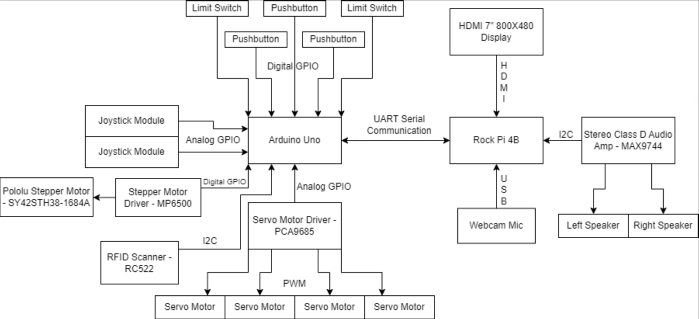
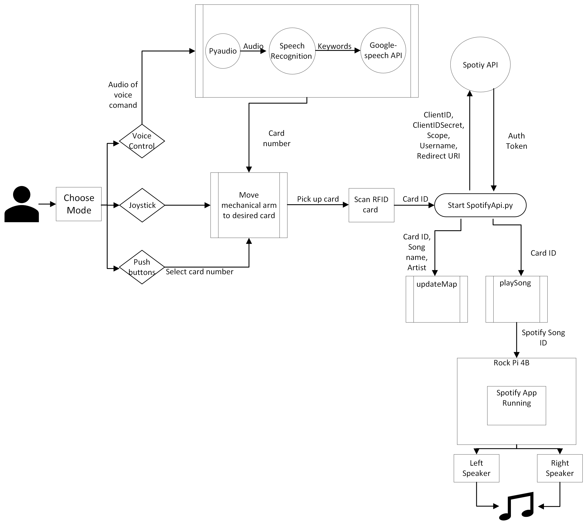

# RFID Jukebox: Redesigning a Classic with Modern Technology

This project was developed as the final requirement for my **Bachelors of Science in Electrical Engineering** at Syracuse University during the 2022-2023 academic year. The RFID Jukebox redesigns the traditional jukebox into a modern, interactive system that combines hardware and software for an enhanced user experience. By leveraging **RFID technology**, **voice commands**, and integration with the **Spotify API**, the jukebox allows users to select and play music effortlessly, offering a blend of nostalgic design and cutting-edge technology.

---

## Project Description

The RFID Jukebox is an innovative system built to modernize a classic jukebox. It features a **robotic arm** controlled by an Arduino Uno to select RFID cards, each mapped to specific songs. The project integrates a Rock Pi 4B, which handles voice commands via the **Google Speech API** and interacts with the Spotify API for music playback. The design incorporates multiple input methods, including push buttons and voice commands, offering a highly interactive and user-friendly experience.

### Key Features
- **Voice Command Recognition:** Utilized the Google Speech API to implement natural voice commands for track selection and playback.
- **RFID Integration:** RFID cards linked to specific songs allow seamless song selection and mapping.
- **Robotic Arm Control:** Programmed a robotic arm to select RFID cards using servo motors and a stepper motor, enhancing automation.
- **Spotify API Integration:** Enabled direct communication with Spotify for music playback.
- **Push Button Control:** Supported track selection through intuitive push buttons for accessibility.
- **High-Quality Audio Playback:** Incorporated an audio amplifier (MAX9744) for crisp and clear sound through external speakers.

---

## Song Library

The RFID Jukebox was programmed with a curated selection of songs that reflect a variety of genres and styles. Each RFID card was mapped to one of the following tracks:

1. **Rock that Body** - Black Eyed Peas  
2. **Boy's a Liar** - PinkPantheress  
3. **Waiting For Love** - Avicii  
4. **Vete** - Bad Bunny  
5. **Traitor** - Olivia Rodrigo  
6. **Get Lucky (feat. Pharrell Williams & Nile Rodgers)** - Daft Punk  
7. **Wonderland** - Taylor Swift  
8. **Wildest Dreams** - Taylor Swift  
9. **Gone Girl** - SZA  
10. **Work Out** - J. Cole  

---

## System Architecture

### Hardware Components
- **Microcontrollers:** Arduino Uno and Rock Pi 4B for hardware-software integration.
- **Sensors:** RFID Scanner (RC522) for card identification.
- **Actuators:** Servo motors and a stepper motor for robotic arm control.
- **Audio Components:** MAX9744 Stereo Class D Amplifier connected to left and right speakers for audio playback.
- **Display:** 7-inch HDMI display for visual feedback.
- **Input Devices:** Push buttons and microphone for multi-input control.

### Software Components
- **Spotify API:** Used for song mapping and playback.
- **Google Speech API:** Enabled voice recognition for seamless user interaction.
- **Arduino Code:** Controlled the robotic arm and interfaced with the RFID scanner.
- **Python Script:** Integrated voice commands, Spotify playback, and robotic arm control into a cohesive system.

---

## Getting Started

### Prerequisites
1. **Hardware Setup:**
   - Assemble the components as per the hardware block diagram.
   - Ensure proper connections for power, communication, and actuators.

2. **Software Requirements:**
   - Arduino IDE for uploading code to the Arduino Uno.
   - Python 3.7+ installed on the Rock Pi 4B.
   - Required Python libraries: `pyaudio`, `spotipy`, `speech_recognition`, `decouple`.

3. **Testing Environment:**
   - Use `spotifyapi.py` and `voiceRecognition.py` to test Spotify API integration and Google Speech API functionality on your local system before running the full system. Adjust credentials and paths as needed in these scripts.

4. **Environment Setup:**
   - Configure Spotify API credentials for the full system in `FinalDemo.py`.
   - Test voice recognition commands to ensure compatibility with your microphone.

---

### How to Use
1. **System Initialization:**
   - Power on the system and ensure all components are functioning.
   - Place RFID cards in the designated slots.

2. **Input Options:**
   - **Voice Commands:** Use the command `Hey DJ` followed by `Play track <number>` to select a song.
   - **Push Buttons:** Manually select tracks using the push buttons.

3. **Music Playback:**
   - The robotic arm will pick the selected RFID card and scan it.
   - The song mapped to the RFID card will play via Spotify.

4. **Demonstration Video:** See the RFID Jukebox in action by watching the **[Demonstration Video](https://drive.google.com/file/d/19_YQ7RKUNr6r7MkGtvs7A4P5PZPm1Kui/view?usp=sharing)**.

---

## Files Included

### Scripts
- **`FinalArduinoCode.ino`**: Controls the robotic arm and interfaces with the RFID scanner.
- **`FinalDemo.py`**: Main script to integrate Spotify API, voice commands, and RFID card scanning.
- **`spotifyapi.py`**: A development script for testing Spotify API integration.  
- **`voiceRecognition.py`**: A development script for testing Google Speech API functionality.

### Documentation
- **Final Report**: Detailed analysis of the project, including challenges and solutions.  
  [**Read the Report**](media/RFID%20Jukebox%20Final%20Report.pdf)

### Media
- **Hardware Block Diagram**: System architecture overview.
- **Software Flow Chart**: High-level software interaction flow.
- **Team Photo**: The RFID Jukebox development team with the final product.  
  
- **Hardware Close-Up**: Back view showcasing hardware components.  
  

---

## Reflections and Future Enhancements

### Achievements
- Successfully combined hardware and software for an interactive music system.
- Developed a reliable robotic arm mechanism and intuitive voice recognition system.
- Delivered high-quality audio playback integrated with Spotify.

### Future Enhancements
- **Dynamic Song Mapping:** Add the ability to map songs to RFID cards dynamically using a mobile app.
- **Enhanced Voice Commands:** Implement more complex voice interactions and multi-language support.
- **Compact Design:** Miniaturize hardware for a sleeker and more portable jukebox.

---

## Acknowledgments

This project was completed under the guidance of Syracuse University faculty and in collaboration with an exceptional team:
- **Jenna Stapleton**
- **Ibrahima Diallo**
- **Elizabeth Fatade**
